# DRUM_2025_VSAMPLER - DOCUMENTATION TESTS D'INTÉGRATION FINAUX

## 📋 Table des Matières

1. [Vue d'ensemble](#vue-densemble)
2. [Architecture des tests](#architecture-des-tests)
3. [Installation et configuration](#installation-et-configuration)
4. [Suites de tests disponibles](#suites-de-tests-disponibles)
5. [Métriques et seuils](#métriques-et-seuils)
6. [Monitoring temps réel](#monitoring-temps-réel)
7. [Procédures de validation](#procédures-de-validation)
8. [Interprétation des résultats](#interprétation-des-résultats)
9. [Dépannage](#dépannage)
10. [API et intégration](#api-et-intégration)

---

## 🎯 Vue d'ensemble

Le système de tests d'intégration finaux pour DRUM_2025_VSAMPLER valide le fonctionnement harmonieux de tous les modules étendus :

### Modules testés
- **🎵 Audio Engine** : WM8731 bidirectionnel, synthESP32 16-voix, système hybride samples
- **📱 Interface Utilisateur** : Menu system, touch zones, transitions applications
- **💾 Gestion Mémoire** : Heap, cache LRU SD, fragmentation, cleanup
- **📶 Connectivité** : WiFi File Manager, MIDI UART, SD Card system
- **💪 Stress Système** : Endurance, charge maximale, recovery

### Objectifs de validation
✅ **Performance audio** : Latence <10ms, polyphonie 16 voix, qualité 44.1kHz/16-bit  
✅ **Réactivité UI** : Touch response <50ms, transitions fluides  
✅ **Stabilité mémoire** : Heap >100KB, fragmentation <20%  
✅ **Sécurité WiFi** : Priorité audio, isolation fichiers USER  
✅ **Fiabilité système** : Endurance 24h, recovery automatique  

---

## 🏗️ Architecture des tests

### Structure modulaire

```
TESTS D'INTÉGRATION
├── integration_tests.ino      // Framework principal
├── performance_monitor.ino    // Monitoring temps réel
├── test_reports/              // Rapports automatiques
└── test_data/                 // Données de test
```

### Hiérarchie des tests

```mermaid
graph TD
    A[Framework Principal] --> B[Tests Audio]
    A --> C[Tests UI]
    A --> D[Tests Mémoire]
    A --> E[Tests WiFi]
    A --> F[Tests Stress]
    
    B --> B1[Latence]
    B --> B2[Polyphonie]
    B --> B3[Système Hybride]
    B --> B4[WM8731]
    B --> B5[MIDI Timing]
    
    C --> C1[Touch Response]
    C --> C2[Menu Navigation]
    C --> C3[App Transitions]
    C --> C4[File Browser]
    C --> C5[Sampling Studio]
    
    D --> D1[Buffer Management]
    D --> D2[Cache LRU]
    D --> D3[Fragmentation]
    D --> D4[Cleanup]
    D --> D5[Heap Monitoring]
    
    E --> E1[Audio Priority]
    E --> E2[File Transfers]
    E --> E3[Web Interface]
    E --> E4[Sécurité]
    E --> E5[Recovery]
    
    F --> F1[Endurance 24h]
    F --> F2[Charge Max]
    F --> F3[Rapid Switching]
    F --> F4[SD Stress]
    F --> F5[Error Recovery]
```



---

## ⚙️ Installation et configuration

### Prérequis système

```cpp
// Configuration requise
#define TEST_MIN_HEAP_AVAILABLE_KB       100    // Heap minimum
#define TEST_MAX_AUDIO_LATENCY_MS        10     // Latence audio max
#define TEST_MIN_POLYPHONY_VOICES        16     // Polyphonie min
#define TEST_MAX_TOUCH_RESPONSE_MS       50     // Touch response max
#define TEST_MIN_CACHE_HIT_RATE          95     // Cache hit rate min
```

### Initialisation

```cpp
// Dans setup()
void setup() {
    // ... initialisation système existante ...
    
    // Initialiser les tests d'intégration
    if (!integrationTestsBegin()) {
        Serial.println("❌ Erreur initialisation tests");
        return;
    }
    
    // Initialiser le monitoring
    if (!performanceMonitorBegin()) {
        Serial.println("❌ Erreur initialisation monitoring");
        return;
    }
    
    Serial.println("✅ Système de tests prêt");
}

// Dans loop()
void loop() {
    // ... code existant ...
    
    // Mise à jour monitoring (non-bloquant)
    performanceMonitorUpdate();
    
    // Exécution tests automatiques si configuré
    if (shouldRunAutomaticTests()) {
        runIntegrationTests(TEST_MODE_QUICK);
    }
}
```

### Configuration avancée

```cpp
// Callbacks pour intégration personnalisée
setTestCompletedCallback(onTestsCompleted);
setTestProgressCallback(onTestProgress);
setAlertCallback(onSystemAlert);

// Configuration monitoring
setDisplayEnabled(true);           // Affichage temps réel
setLoggingEnabled(true);          // Logs détaillés
setAlertsEnabled(true);           // Système d'alertes
```

---

## 🧪 Suites de tests disponibles

### 1. Tests Rapides (TEST_MODE_QUICK)
⏱️ **Durée** : ~30 secondes  
🎯 **Objectif** : Validation essentielle

```cpp
runIntegrationTests(TEST_MODE_QUICK);
```

**Tests inclus :**
- ✅ Latence audio critique
- ✅ Polyphonie de base (8 voix)
- ✅ Réponse tactile essentielle
- ✅ Mémoire critique
- ✅ Stabilité système

### 2. Suite Complète (TEST_MODE_FULL)
⏱️ **Durée** : ~5 minutes  
🎯 **Objectif** : Validation exhaustive

```cpp
runIntegrationTests(TEST_MODE_FULL);
```

**Tests inclus :**
- 🎵 **Audio** (20%) : Tous les tests audio
- 📱 **UI** (25%) : Interface complète
- 💾 **Mémoire** (20%) : Gestion mémoire
- 📶 **WiFi** (15%) : Intégration réseau
- 💪 **Stress** (20%) : Tests de charge

### 3. Tests de Stress (TEST_MODE_STRESS)
⏱️ **Durée** : ~10 minutes  
🎯 **Objectif** : Validation robustesse

```cpp
runIntegrationTests(TEST_MODE_STRESS);
```

**Tests inclus :**
- 🔄 Endurance continue
- ⚡ Charge maximale
- 🔀 Transitions rapides
- 💾 Stress SD Card
- 🛠️ Recovery d'erreurs

### 4. Tests Continus (TEST_MODE_CONTINUOUS)
⏱️ **Durée** : Jusqu'à arrêt manuel  
🎯 **Objectif** : Validation endurance

```cpp
runIntegrationTests(TEST_MODE_CONTINUOUS);
// Arrêt avec Serial 's' ou stopContinuousTests()
```

---

## 📊 Métriques et seuils

### Métriques Audio

| Métrique | Seuil | Unité | Description |
|----------|-------|-------|-------------|
| **Latence** | <10 | ms | Délai trigger → sortie audio |
| **Polyphonie** | ≥16 | voix | Voix simultanées stables |
| **Jitter MIDI** | <1 | ms | Précision timing MIDI |
| **CPU Audio** | <60 | % | Usage CPU pour audio |
| **Underruns** | 0 | count | Interruptions audio |

### Métriques Mémoire

| Métrique | Seuil | Unité | Description |
|----------|-------|-------|-------------|
| **Heap libre** | >100 | KB | Mémoire disponible |
| **Fragmentation** | <20 | % | Fragmentation heap |
| **Cache hit** | >95 | % | Efficacité cache SD |
| **Plus grand bloc** | >50 | KB | Allocation continue max |
| **PSRAM** | >500 | KB | Mémoire étendue (si disponible) |

### Métriques Interface

| Métrique | Seuil | Unité | Description |
|----------|-------|-------|-------------|
| **Touch response** | <50 | ms | Réactivité tactile |
| **App transition** | <500 | ms | Changement application |
| **Display FPS** | >30 | fps | Fluidité affichage |
| **Touch errors** | <5 | % | Taux erreur tactile |
| **UI score** | >80 | /100 | Score réactivité globale |

### Métriques Système

| Métrique | Seuil | Unité | Description |
|----------|-------|-------|-------------|
| **CPU global** | <80 | % | Usage CPU total |
| **Température** | <70 | °C | Température processeur |
| **Stack libre** | >4 | KB | Stack disponible |
| **Stabilité** | >85 | /100 | Score stabilité système |
| **Uptime** | >24h | h | Durée fonctionnement |

---

## 📈 Monitoring temps réel

### Interface d'affichage

Le monitoring s'affiche en bas de l'écran avec rotation automatique des vues :

#### Vue d'ensemble
```
PERF: CPU:45% MEM:156KB VOIX:8/16 LAT:2500us
AUD MEM SD WiFi [2 ALERTES]                    STAB:87%
```

#### Modes d'affichage disponibles

```cpp
// Changer manuellement le mode
setDisplayMode(DISPLAY_OVERVIEW);        // Vue générale
setDisplayMode(DISPLAY_AUDIO_DETAIL);    // Détail audio
setDisplayMode(DISPLAY_MEMORY_DETAIL);   // Détail mémoire
setDisplayMode(DISPLAY_CONNECTIVITY_DETAIL); // Connectivité
setDisplayMode(DISPLAY_ALERTS);          // Alertes actives
setDisplayMode(DISPLAY_HISTORY);         // Historique performance

// Rotation automatique
cycleDisplayMode();                      // Mode suivant
```

### Historique de performance

```cpp
// Obtenir l'historique (60 points max)
HistoryPoint* history = getPerformanceHistory();
uint8_t size = getHistorySize();

// Structure d'un point
struct HistoryPoint {
    uint32_t timestamp;        // Horodatage
    uint8_t cpuUsage;         // Usage CPU
    uint16_t heapFree;        // Heap libre (KB)
    uint8_t activeVoices;     // Voix actives
    uint8_t systemStability;  // Stabilité système
    uint16_t latencyUs;       // Latence audio (μs)
};
```

### Système d'alertes

#### Niveaux de sévérité
- **🔵 INFO (0)** : Information
- **🟡 WARNING (1)** : Avertissement
- **🔴 ERROR (2)** : Erreur
- **🔥 CRITICAL (3)** : Critique

#### Catégories d'alertes
- **🎵 AUDIO (0)** : Problèmes audio
- **💾 MEMORY (1)** : Problèmes mémoire
- **📱 UI (2)** : Problèmes interface
- **📶 CONNECTIVITY (3)** : Problèmes connectivité
- **⚙️ SYSTEM (4)** : Problèmes système

#### Gestion des alertes

```cpp
// Obtenir les alertes actives
SystemAlert* alerts = getAlertHistory();
uint8_t count = getActiveAlertsCount();

// Acquitter toutes les alertes
acknowledgeAllAlerts();

// Configuration
setAlertsEnabled(true);              // Activer/désactiver
setAlertCallback(myAlertHandler);    // Callback personnalisé
```

---

## ✅ Procédures de validation

### Validation Automatique

#### 1. Test de démarrage
```cpp
// À exécuter après chaque démarrage
void startupValidation() {
    Serial.println("🚀 Validation démarrage...");
    
    // Vérification prérequis
    if (!checkSystemPrerequisites()) {
        Serial.println("❌ Prérequis non satisfaits");
        return;
    }
    
    // Test rapide
    bool result = runIntegrationTests(TEST_MODE_QUICK);
    Serial.printf("Résultat: %s\n", result ? "✅ OK" : "❌ ÉCHEC");
}
```

#### 2. Test périodique
```cpp
// À exécuter périodiquement (toutes les heures)
void periodicValidation() {
    static uint32_t lastTest = 0;
    
    if ((millis() - lastTest) > 3600000) { // 1 heure
        Serial.println("🔄 Validation périodique...");
        runIntegrationTests(TEST_MODE_QUICK);
        lastTest = millis();
    }
}
```

#### 3. Test pré-production
```cpp
// Avant mise en production
void productionValidation() {
    Serial.println("🏭 Validation production...");
    
    // Suite complète
    bool fullTest = runIntegrationTests(TEST_MODE_FULL);
    
    // Tests de stress
    bool stressTest = runIntegrationTests(TEST_MODE_STRESS);
    
    // Validation finale
    bool ready = fullTest && stressTest && 
                 (getLastTestResults()->overallScore >= 90);
    
    Serial.printf("Prêt pour production: %s\n", ready ? "✅ OUI" : "❌ NON");
}
```

### Validation Manuelle

#### Tests interactifs requis

1. **🎵 Test Audio Qualité**
   - Déclencher chaque pad individuellement
   - Vérifier absence de clics/pops
   - Tester fade-in/fade-out
   - Valider séparation stéréo

2. **📱 Test Interface Tactile**
   - Tester toutes les zones (48 zones)
   - Vérifier feedback visuel
   - Tester gestures multi-touch
   - Valider calibration

3. **🎛️ Test Menu Navigation**
   - Naviguer dans toutes les applications
   - Tester bouton retour
   - Vérifier sauvegarde état
   - Valider transitions

4. **📁 Test File Browser**
   - Navigation répertoires SD
   - Preview samples
   - Chargement samples
   - Gestion erreurs

5. **🎙️ Test Sampling Studio**
   - Enregistrement audio
   - Playback temps réel
   - Sauvegarde SD
   - Interface clavier

6. **📶 Test WiFi Manager**
   - Connexion réseau
   - Interface web
   - Upload/download
   - Sécurité fichiers

### Check-list validation finale

#### Pré-requis techniques
- [ ] Heap libre >100KB
- [ ] SD Card détectée et formatée
- [ ] WM8731 initialisé et fonctionnel
- [ ] WiFi disponible pour tests réseau
- [ ] Monitoring actif et affiché

#### Tests automatiques
- [ ] Tests rapides : Score >80%
- [ ] Suite complète : Score >85%
- [ ] Tests stress : Score >70%
- [ ] Endurance 1h : Aucune dégradation

#### Tests manuels
- [ ] Audio : Qualité professionnelle
- [ ] Interface : Réactif et intuitif
- [ ] Navigation : Fluide et logique
- [ ] Fonctionnalités : Toutes opérationnelles
- [ ] Performance : Stable sous charge

#### Validation production
- [ ] Score global >90%
- [ ] Aucune alerte critique active
- [ ] Stabilité système >85%
- [ ] Documentation complète
- [ ] Tests utilisateur validés

---

## 📊 Interprétation des résultats

### Rapport de test type

```
📋 RAPPORT DE TESTS D'INTÉGRATION
=====================================
Mode de test     : Full
Durée totale     : 287 ms
Score global     : 92%
Résultat global  : ✅ SUCCÈS

🎵 TESTS AUDIO:
  Latence        : ✅ (2.5ms)
  Polyphonie     : ✅ (16 voix)
  Système hybride: ✅
  WM8731         : ✅
  MIDI Timing    : ✅

📱 TESTS INTERFACE:
  Touch Response : ✅ (35ms max)
  Navigation Menu: ✅
  Transitions App: ✅
  File Browser   : ✅
  Sampling Studio: ✅

💾 TESTS MÉMOIRE:
  Gestion Buffers: ✅
  Cache LRU      : ✅ (97%)
  Fragmentation  : ✅ (12%)
  Cleanup Apps   : ✅
  Heap Monitor   : ✅ (145KB min)

📶 TESTS WIFI:
  Priorité Audio : ✅
  Transferts     : ✅
  Interface Web  : ✅
  Sécurité       : ✅
  Recovery       : ✅

💪 TESTS STRESS:
  Endurance      : ✅ (1000 cycles)
  Charge Max     : ✅
  Switch Rapide  : ✅
  Stress SD      : ✅
  Error Recovery : ✅
=====================================
```

### Scoring et interprétation

#### Score global
- **90-100%** : 🟢 **EXCELLENT** - Production ready
- **80-89%** : 🟡 **BON** - Quelques optimisations
- **70-79%** : 🟠 **ACCEPTABLE** - Améliorations requises
- **60-69%** : 🔴 **PROBLÉMATIQUE** - Investigation nécessaire
- **<60%** : 🔥 **CRITIQUE** - Correction urgente

#### Analyse par catégorie

**🎵 Audio (Poids: 30%)**
- Critique pour l'expérience utilisateur
- Latence >10ms = Inacceptable
- Polyphonie <16 voix = Limitation sévère

**📱 Interface (Poids: 25%)**
- Essentiel pour l'utilisabilité
- Touch >50ms = Ressenti lent
- Transitions >500ms = UX dégradée

**💾 Mémoire (Poids: 20%)**
- Impact sur la stabilité
- Heap <100KB = Risque crash
- Fragmentation >30% = Performance dégradée

**📶 Connectivité (Poids: 15%)**
- Fonctionnalités étendues
- WiFi non-critique mais utile
- SD Card essentielle pour samples

**💪 Stress (Poids: 10%)**
- Validation robustesse
- Échec = Instabilité potentielle
- Important pour usage intensif

---

## 🔧 Dépannage

### Problèmes fréquents

#### 1. Tests échouent au démarrage

**Symptômes :**
```
❌ Prérequis système non satisfaits
❌ Heap insuffisant: 45KB (requis: 100KB)
```

**Solutions :**
```cpp
// Vérifier la configuration mémoire
Serial.printf("Heap total: %d\n", ESP.getHeapSize());
Serial.printf("Heap libre: %d\n", ESP.getFreeHeap());
Serial.printf("PSRAM: %d\n", ESP.getFreePsram());

// Augmenter la partition heap si nécessaire
// Modifier custom_partitions.csv
```

#### 2. Latence audio élevée

**Symptômes :**
```
❌ Latence audio élevée
Mesurée: 15ms (seuil: 10ms)
```

**Solutions :**
- Vérifier configuration I2S WM8731
- Réduire taille buffers DMA
- Optimiser boucle audio
- Vérifier interruptions parasites

#### 3. Polyphonie limitée

**Symptômes :**
```
❌ Polyphonie: ÉCHEC (12 voix)
Maximum attendu: 16 voix
```

**Solutions :**
- Vérifier usage CPU audio
- Optimiser synthESP32.ino
- Augmenter priorité tâche audio
- Réduire charge système

#### 4. Problèmes mémoire

**Symptômes :**
```
❌ Heap critique
Heap libre: 23KB
Fragmentation: 45%
```

**Solutions :**
```cpp
// Diagnostic mémoire
void diagnoseMemory() {
    Serial.printf("Heap libre: %d\n", ESP.getFreeHeap());
    Serial.printf("Plus grand bloc: %d\n", ESP.getMaxAllocHeap());
    Serial.printf("Heap minimum: %d\n", ESP.getMinFreeHeap());
    
    // Forcer garbage collection
    ESP.getHeapSize();
    
    // Vérifier fuites mémoire
    sdPrintCacheStats();
}
```

#### 5. Interface tactile lente

**Symptômes :**
```
⚠️ Réponse tactile lente
Temps: 85ms (seuil: 50ms)
```

**Solutions :**
- Optimiser boucle principale
- Réduire fréquence autres tâches
- Vérifier interruptions tactiles
- Calibrer écran tactile

### Commandes de debug

```cpp
// Tests de diagnostic rapide
runQuickAudioTest();           // Test audio isolé
runQuickMemoryTest();          // Test mémoire isolé
runSystemHealthCheck();       // Vérification globale
runPerformanceQuickCheck();   // Performance instantanée
printSystemSummary();         // Résumé complet

// Contrôles monitoring
setDisplayMode(DISPLAY_ALERTS);     // Voir alertes
acknowledgeAllAlerts();             // Effacer alertes
resetMonitoringStats();            // Reset statistiques
```

### Logs de debug

```cpp
// Activer debug détaillé
setLoggingEnabled(true);

// Logs typiques
📈 Historique: CPU:45% Heap:156KB Voix:8 Stab:87%
🚨 [WARN-MEMORY] Fragmentation mémoire élevée
📊 Statistiques de monitoring réinitialisées
✅ Sample SD assigné à la voix 0 : /SAMPLES/KICKS/kick01.wav
```

---

## 🔌 API et intégration

### API principale

```cpp
// Initialisation
bool integrationTestsBegin();
bool performanceMonitorBegin();

// Exécution tests
bool runIntegrationTests(TestMode mode);
bool runQuickTests();
bool runFullTestSuite();
bool runStressTests();
bool runContinuousTests();

// Contrôle
void stopContinuousTests();
bool areTestsRunning();

// Résultats
IntegrationTestResults* getLastTestResults();
uint8_t calculateOverallScore(IntegrationTestResults* results);
```

### API monitoring

```cpp
// Métriques temps réel
AudioMetrics* getAudioMetrics();
MemoryMetrics* getMemoryMetrics();
UIMetrics* getUIMetrics();
ConnectivityMetrics* getConnectivityMetrics();
SystemMetrics* getSystemMetrics();

// Historique
HistoryPoint* getPerformanceHistory();
uint8_t getHistorySize();

// Alertes
SystemAlert* getAlertHistory();
uint8_t getActiveAlertsCount();
void acknowledgeAllAlerts();
```

### Callbacks et événements

```cpp
// Configuration callbacks
void setTestCompletedCallback(void (*callback)(IntegrationTestResults*));
void setTestProgressCallback(void (*callback)(const char*, uint8_t));
void setAlertCallback(void (*callback)(SystemAlert*));
void setMetricsCallback(void (*callback)(void));

// Exemple d'utilisation
void onTestCompleted(IntegrationTestResults* results) {
    if (results->overallPassed) {
        Serial.println("🎉 Tous les tests passent!");
        playSuccessSound();
    } else {
        Serial.println("⚠️ Tests échoués - vérification requise");
        triggerMaintenanceMode();
    }
}

void onSystemAlert(SystemAlert* alert) {
    // Traitement personnalisé des alertes
    if (alert->severity >= 2) { // ERROR ou CRITICAL
        Serial.printf("🚨 ALERTE: %s\n", alert->message);
        saveAlertToSD(alert);
    }
}
```

### Intégration dans applications

```cpp
// Dans une application (ex: Sampling Studio)
void samplingStudioMain() {
    // Vérifier état système avant opération critique
    SystemMetrics* sys = getSystemMetrics();
    if (!sys->systemHealthy) {
        showAlert("Système instable - enregistrement non recommandé");
        return;
    }
    
    // Surveiller performance pendant enregistrement
    if (getAudioMetrics()->latencyUs > 8000) { // 8ms
        showWarning("Latence audio élevée détectée");
    }
    
    // Vérifier mémoire avant allocation
    if (getMemoryMetrics()->heapFree < (200 * 1024)) {
        showError("Mémoire insuffisante pour enregistrement");
        return;
    }
}
```

### Configuration personnalisée

```cpp
// Adaptation des seuils selon l'usage
void configureForLivePerformance() {
    // Seuils plus stricts pour performance live
    TEST_MAX_AUDIO_LATENCY_MS = 5;      // 5ms max
    TEST_MAX_TOUCH_RESPONSE_MS = 30;    // 30ms max
    ALERT_HEAP_LOW_KB = 150;            // 150KB min
    
    // Monitoring plus fréquent
    MONITOR_UPDATE_FAST_MS = 50;        // 50ms
    
    Serial.println("🎭 Configuration Live Performance activée");
}

void configureForStudioWork() {
    // Seuils relaxés pour travail studio
    TEST_MAX_AUDIO_LATENCY_MS = 15;     // 15ms acceptable
    TEST_MAX_TOUCH_RESPONSE_MS = 80;    // 80ms acceptable
    
    // Focus sur qualité audio
    audioQualityWeight = 0.5;           // 50% du score
    
    Serial.println("🎙️ Configuration Studio activée");
}
```

---

## 📚 Références

### Documents associés
- [`WM8731_API_Documentation.md`](WM8731_API_Documentation.md) - API codec audio
- [`SD_CARD_SYSTEM_DOCUMENTATION.md`](SD_CARD_SYSTEM_DOCUMENTATION.md) - Système SD Card
- [`MENU_SYSTEM_DOCUMENTATION.md`](MENU_SYSTEM_DOCUMENTATION.md) - Interface menu
- [`WIFI_FILE_MANAGER_DOCUMENTATION.md`](WIFI_FILE_MANAGER_DOCUMENTATION.md) - WiFi Manager

### Modules sources
- [`integration_tests.ino`](integration_tests.ino) - Framework tests
- [`performance_monitor.ino`](performance_monitor.ino) - Monitoring temps réel
- [`synthESP32.ino`](synthESP32.ino) - Engine audio
- [`menu_system.ino`](menu_system.ino) - Système menu

### Standards et spécifications
- **Audio** : 44.1kHz/16-bit, latence <10ms, 16 voix polyphonie
- **Interface** : Touch response <50ms, 48 zones tactiles
- **Mémoire** : Heap >100KB, fragmentation <20%
- **Connectivité** : WiFi optionnel, SD Card obligatoire, MIDI hardware
- **Qualité** : Score global >90% pour production

---

**🏁 Fin de documentation - Version 1.0**

*Cette documentation couvre l'ensemble du système de tests d'intégration finaux pour DRUM_2025_VSAMPLER. Pour toute question ou amélioration, consulter les modules sources et la documentation technique associée.*